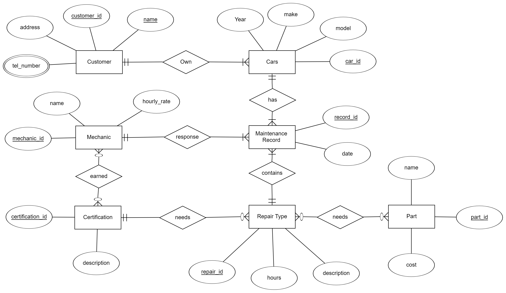
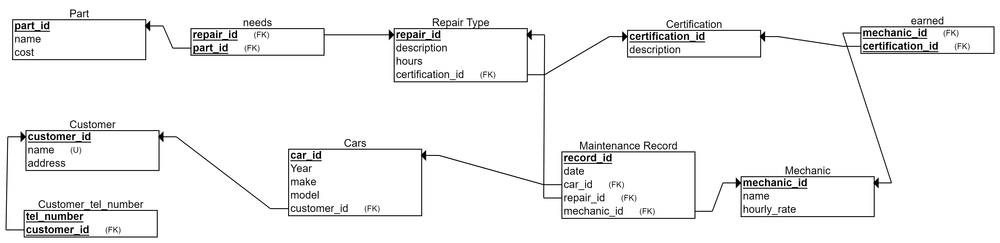

# Team DBG CS4604 Project

## Team Members

- guang15, Guangchen Li
- lmcn, Mingchi Li

## Project Description

This project is to help Hot Wheels Auto Repair create a database backed application that will track customers and their cars.

Each customer has a unique name, address and multiple phone numbers.

Develop a system to keep track of which cars belong to each customer. The year, make and model of each car should be tracked. Users should be able to update information about customers and their cars as well as add new customers and cars.

## Entity Relationship

The entities in this project are **Customer**, **Cars**, **Maintenance Record**, **Repair Type**, **Mechanic**, **Certification** and **Part**.

A Customer is uniquely identified by *customer_id* or the *name*.
One Customer own many Cars.

A Car has many Maintenance Record. A maintenance is uniquely identified by record_id.

A maintenance contains a repair type and a mechanic.

## Relational

The diagram below shows the entity-relationship diagram converted to a relational schema.

## Build/Install/Run

Because of the time constraints, we didn't have time to write about the shellsript and dockerfile. So if you want to run the application, you need to run the postgres database locally.

1. Start psql
2. Create a user called postgres with a password of postgres.
3. Log in with postgres and create a database called hot_wheels.
4. Open another terminal to run: `git clone https://github.com/LMCNN/hot_wheels.git`
5. Move the path to the sql directory and run the first line of install.sql and load.sql.
6. Move the path to the code directory and run: `./mvnw spring-boot:run`

